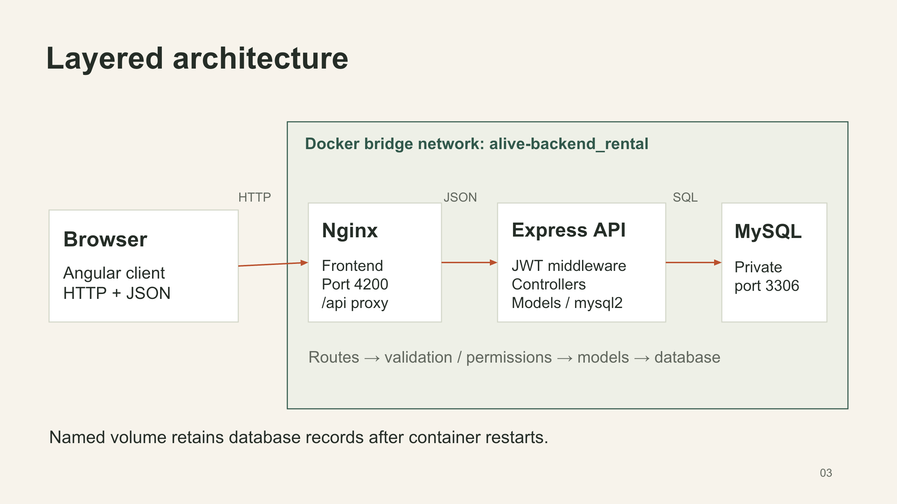
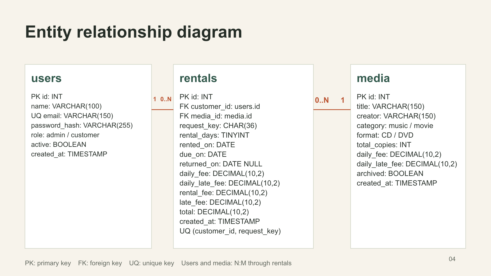

# The Days We Felt Alive — CD/DVD Rental Management System

A small rental shop API for music and movie CDs/DVDs. Customers rent online and return physical copies at the shop. Admins maintain the collection, customer accounts and returns. Course: **66-131217 Back-end Software Development**.

## Quick start

Requirements: Docker Desktop or Docker Engine with Compose. Ports 3017 and 4200 must be free.

```sh
docker compose up -d --build
```

Run this command from this backend repository. It starts Express and MySQL, creates the three tables and seeds the admin and six fictional catalog titles. API: `http://localhost:3017/api/v1`. Health: `http://localhost:3017/api/v1/health`.

For a local classroom demo, no environment file is required. Default admin: **admin@example.com / ChangeMe123!**. These are local sample credentials only. The API port binds to localhost and MySQL has no published port. Before any public deployment, copy `.env.example` to `.env` and replace JWT, admin and database credentials with your own values. Never commit `.env`. Existing admin passwords do not reset on restart.

```sh
cp .env.example .env
# Edit .env before starting when using custom credentials.
docker compose up -d --build
docker compose ps
```

### Separate Angular frontend

The frontend is a separate project/repository. With sibling folders `backend/` and `frontend/`:

```sh
cd ../frontend
docker compose up -d --build
```

Open `http://localhost:4200`. Start the backend first: frontend Nginx joins the existing `alive-backend_rental` network and forwards `/api/` to `express-api:3000`. This works without exposing MySQL or requiring browser CORS configuration. Angular development mode uses a proxy to `http://localhost:3017`.

## Architecture and communication



A simple layered application: routes select controllers, middleware checks JWT/roles, controllers validate input, models execute parameterized SQL, and MySQL persists data. There is one API application, not a microservice gateway.

1. Browser loads the Angular application from the frontend Nginx container on port 4200.
2. Angular HttpClient sends JSON requests to `/api/v1` on the same origin. Its interceptor adds a Bearer token to protected requests.
3. Nginx forwards API traffic through the Docker bridge network to Express. Express routes run auth, role and ownership checks, then controllers and models.
4. Models use mysql2 to access MySQL at `database:3306`. MySQL stores data in the named `rental-data` volume. API responses travel back through Nginx to the browser.

Node.js 24, Express 5, MySQL 8.4, bcryptjs and jsonwebtoken power the backend. Angular 22 powers the separate frontend. Architecture and ERD are also editable in the presentation deck.

## Database model



- `users`: account details, password hash, role, active state and timestamp. Admin/customer share this table.
- `media`: title, creator, music/movie category, CD/DVD format, total copies, per-day fees, archive state and timestamp.
- `rentals`: user/media foreign keys, unique customer request key, dates, days, fee snapshots and totals.

A user has zero or many rentals (1:N). A media title has zero or many rentals (1:N). Every rental belongs to exactly one customer and one media title. Users and media have an N:M relationship resolved through rentals. There is no artificial 1:1 relationship because this domain does not need one. See `database/schema.sql` for complete field types, PK/FK, indexes and checks.

## Rental rules

- One rental means one physical copy of one title. Online confirmation starts the rental today and immediately occupies stock. The customer collects and returns the copy at the shop.
- Rentals last 1-30 days. Due date = current Bangkok calendar date + selected days. A one-day rental starting October 9 is due October 10.
- Available copies = total copies - rentals with no returned date. No independently stored stock counter can drift.
- A customer row lock serializes retries/deactivation. A media row lock serializes stock allocation. Transactions use READ COMMITTED so waiting requests see the latest rental count. All rental creation locks follow customer-then-media order.
- Rental fee = original daily fee × selected days. Late fee = original daily late fee × overdue calendar days, minimum zero. Due-date returns incur no fine. Currency is THB, decimal 2 places. Calculation uses integer cents.
- Each rental snapshots both daily rates. Editing catalog prices does not change existing rentals. While active, `late_fee`/`total` remain stored baseline values, while `estimated_late_fee`/`estimated_total` show current charges. Return freezes final values.
- Customer-generated UUID v4 keys prevent repeated creation. Retrying after a network failure must reuse the same key and payload. A unique `(customer_id, request_key)` constraint is the final database guard.
- Return is idempotent. Customers cannot return their own records or read another customer's record.
- Delete rejects records with active rentals. With returned history, it archives media or deactivates customers. Without history, it physically deletes the record. Admins can unarchive/reactivate through PATCH. Inactive users cannot use existing JWTs.
- Sample titles are fictional. Catalog seeding only runs when the media table is empty and `SEED_SAMPLE_DATA=true`.
- No online payments, deliveries, pending approvals, image uploads or notifications. Recorded fees are charges, not collected revenue.

## Authentication and API conventions

JSON request/response format. Base URL: `http://localhost:3017/api/v1`. For protected endpoints:

```http
Authorization: Bearer <TOKEN>
Content-Type: application/json
```

Login JWTs expire in 2 hours by default. HS256 verification pins issuer `alive-api` and audience `alive-client`. The backend reloads account role/active status on every protected request. Public registration never accepts a role. Passwords use bcrypt cost 12 and never appear in responses. Auth endpoints allow 50 requests per IP per 15 minutes. Limit responses use 429.

Success envelope: `{"data": ...}`. Lists return `data: []` when empty. Errors use `{"error":{"message":"..."}}`. No SQL details, tokens or password hashes are logged. Unsupported body fields and empty PATCH bodies return 400. Dates use `YYYY-MM-DD` in Asia/Bangkok. Database timestamps are UTC.

| Status | Meaning                                                                        |
| ------ | ------------------------------------------------------------------------------ |
| 200    | Read/update/delete success or rental replay                                    |
| 201    | New resource created                                                           |
| 400    | Invalid JSON, invalid fields or parameters                                     |
| 401    | Missing/invalid/expired token or unavailable account                           |
| 403    | Wrong role or rental ownership                                                 |
| 404    | Resource or endpoint not found                                                 |
| 409    | Duplicate email, unavailable stock, conflicting request key or unsafe deletion |
| 413    | JSON body exceeds 16 KB                                                        |
| 429    | Too many authentication attempts                                               |
| 500    | Unexpected server/database failure                                             |

## API summary report

Examples below illustrate response shapes; ids, dates and rates depend on your data. All route parameters named `id` are positive integers. Protected routes can also return 401/403, and all routes can return 500. GET/DELETE requests have no JSON body.

| Method | Path                    | Authentication                |
| ------ | ----------------------- | ----------------------------- |
| GET    | `/api/v1/health`        | Public                        |
| POST   | `/api/v1/auth/register` | Public                        |
| POST   | `/api/v1/auth/login`    | Public                        |
| GET    | `/api/v1/auth/me`       | Any active authenticated user |
| GET    | `/api/v1/media`         | Public, optional Bearer token |
| GET    | `/api/v1/media/:id`     | Public, optional Bearer token |
| POST   | `/api/v1/media`         | Admin                         |
| PATCH  | `/api/v1/media/:id`     | Admin                         |
| DELETE | `/api/v1/media/:id`     | Admin                         |
| GET    | `/api/v1/customers`     | Admin                         |
| GET    | `/api/v1/customers/:id` | Admin                         |
| POST   | `/api/v1/customers`     | Admin                         |
| PATCH  | `/api/v1/customers/:id` | Admin                         |
| DELETE | `/api/v1/customers/:id` | Admin                         |
| GET    | `/api/v1/rentals`       | Customer or Admin             |
| GET    | `/api/v1/rentals/:id`   | Customer (owner) or Admin     |
| POST   | `/api/v1/rentals`       | Customer                      |
| PATCH  | `/api/v1/rentals/:id`   | Admin                         |

### GET /api/v1/health

**Authentication:** Public.

**Body / parameters:** No parameters

Success `200`:

```json
{
  "data": {
    "status": "ok"
  }
}
```

Failure example `500`:

```json
{
  "error": {
    "message": "Internal server error"
  }
}
```

### POST /api/v1/auth/register

**Authentication:** Public.

**Body / parameters:** Name: 1-100 characters. Email: valid, unique, max 150. Password: 8 characters minimum, 72 bytes maximum. Role cannot be supplied.

Request JSON:

```json
{
  "name": "Demo Customer",
  "email": "demo@example.com",
  "password": "DemoCustomer123!"
}
```

Success `201`:

```json
{
  "data": {
    "id": 2,
    "name": "Demo Customer",
    "email": "demo@example.com",
    "role": "customer",
    "active": true,
    "created_at": "2026-10-09 08:00:00"
  }
}
```

Failure example `409`:

```json
{
  "error": {
    "message": "A record with this value already exists"
  }
}
```

### POST /api/v1/auth/login

**Authentication:** Public.

**Body / parameters:** Valid email and password. Inactive users cannot log in.

Request JSON:

```json
{
  "email": "demo@example.com",
  "password": "DemoCustomer123!"
}
```

Success `200`:

```json
{
  "data": {
    "token": "<JWT>",
    "user": {
      "id": 2,
      "name": "Demo Customer",
      "email": "demo@example.com",
      "role": "customer",
      "active": true,
      "created_at": "2026-10-09 08:00:00"
    }
  }
}
```

Failure example `401`:

```json
{
  "error": {
    "message": "Email or password is incorrect"
  }
}
```

### GET /api/v1/auth/me

**Authentication:** Any active authenticated user.

**Body / parameters:** No parameters

Success `200`:

```json
{
  "data": {
    "id": 2,
    "name": "Demo Customer",
    "email": "demo@example.com",
    "role": "customer",
    "active": true,
    "created_at": "2026-10-09 08:00:00"
  }
}
```

Failure example `401`:

```json
{
  "error": {
    "message": "Invalid or expired token"
  }
}
```

### GET /api/v1/media

**Authentication:** Public, optional Bearer token.

**Body / parameters:** Optional query: search (title substring, max 150), category (music/movie), format (CD/DVD). Admin sees archived items. Public/customers see listed items only.

Success `200`:

```json
{
  "data": [
    {
      "id": 1,
      "title": "Moonlit Sessions",
      "creator": "The Lanterns",
      "category": "music",
      "format": "CD",
      "total_copies": 4,
      "daily_fee": 15,
      "daily_late_fee": 5,
      "archived": false,
      "created_at": "2026-10-09 08:00:00",
      "available_copies": 4
    }
  ]
}
```

Failure example `400`:

```json
{
  "error": {
    "message": "category must be one of music, movie"
  }
}
```

### GET /api/v1/media/:id

**Authentication:** Public, optional Bearer token.

**Body / parameters:** id: positive integer. Archived items visible only to admin.

Success `200`:

```json
{
  "data": {
    "id": 1,
    "title": "Moonlit Sessions",
    "creator": "The Lanterns",
    "category": "music",
    "format": "CD",
    "total_copies": 4,
    "daily_fee": 15,
    "daily_late_fee": 5,
    "archived": false,
    "created_at": "2026-10-09 08:00:00",
    "available_copies": 4
  }
}
```

Failure example `404`:

```json
{
  "error": {
    "message": "Media not found"
  }
}
```

### POST /api/v1/media

**Authentication:** Admin.

**Body / parameters:** All fields required. title/creator: 1-150 chars. category: music/movie. format: CD/DVD. total_copies: integer 1-999. Fee values: numeric 0-9999.99, max 2 decimal places.

Request JSON:

```json
{
  "title": "Moonlit Sessions",
  "creator": "The Lanterns",
  "category": "music",
  "format": "CD",
  "total_copies": 4,
  "daily_fee": 15,
  "daily_late_fee": 5
}
```

Success `201`:

```json
{
  "data": {
    "id": 1,
    "title": "Moonlit Sessions",
    "creator": "The Lanterns",
    "category": "music",
    "format": "CD",
    "total_copies": 4,
    "daily_fee": 15,
    "daily_late_fee": 5,
    "archived": false,
    "created_at": "2026-10-09 08:00:00",
    "available_copies": 4
  }
}
```

Failure example `400`:

```json
{
  "error": {
    "message": "total_copies must be an integer from 1 to 999"
  }
}
```

### PATCH /api/v1/media/:id

**Authentication:** Admin.

**Body / parameters:** id: positive integer. One or more POST fields or archived (boolean). Cannot reduce total copies below active rentals or archive with active rentals.

Request JSON:

```json
{
  "daily_fee": 20,
  "total_copies": 5
}
```

Success `200`:

```json
{
  "data": {
    "id": 1,
    "title": "Moonlit Sessions",
    "creator": "The Lanterns",
    "category": "music",
    "format": "CD",
    "total_copies": 5,
    "daily_fee": 20,
    "daily_late_fee": 5,
    "archived": false,
    "created_at": "2026-10-09 08:00:00",
    "available_copies": 5
  }
}
```

Failure example `409`:

```json
{
  "error": {
    "message": "Total copies cannot be lower than active rentals"
  }
}
```

### DELETE /api/v1/media/:id

**Authentication:** Admin.

**Body / parameters:** id: positive integer. No history: delete. Returned history: archive. Active rentals: reject.

Success `200`:

```json
{
  "data": {
    "message": "Media archived. Rental history retained"
  }
}
```

Failure example `409`:

```json
{
  "error": {
    "message": "Return all active rentals before deleting this media"
  }
}
```

### GET /api/v1/customers

**Authentication:** Admin.

**Body / parameters:** Includes active and inactive customer accounts. Never includes admin accounts or password hashes.

Success `200`:

```json
{
  "data": [
    {
      "id": 2,
      "name": "Demo Customer",
      "email": "demo@example.com",
      "role": "customer",
      "active": true,
      "created_at": "2026-10-09 08:00:00"
    }
  ]
}
```

Failure example `403`:

```json
{
  "error": {
    "message": "This action is not permitted for your role"
  }
}
```

### GET /api/v1/customers/:id

**Authentication:** Admin.

**Body / parameters:** id: positive integer belonging to a customer.

Success `200`:

```json
{
  "data": {
    "id": 2,
    "name": "Demo Customer",
    "email": "demo@example.com",
    "role": "customer",
    "active": true,
    "created_at": "2026-10-09 08:00:00"
  }
}
```

Failure example `404`:

```json
{
  "error": {
    "message": "Customer not found"
  }
}
```

### POST /api/v1/customers

**Authentication:** Admin.

**Body / parameters:** Same name/email/password validation as registration. Always creates a customer.

Request JSON:

```json
{
  "name": "Demo Customer",
  "email": "demo@example.com",
  "password": "DemoCustomer123!"
}
```

Success `201`:

```json
{
  "data": {
    "id": 2,
    "name": "Demo Customer",
    "email": "demo@example.com",
    "role": "customer",
    "active": true,
    "created_at": "2026-10-09 08:00:00"
  }
}
```

Failure example `409`:

```json
{
  "error": {
    "message": "A record with this value already exists"
  }
}
```

### PATCH /api/v1/customers/:id

**Authentication:** Admin.

**Body / parameters:** id: positive integer. One or more name, email, password, active fields. active must be boolean. Omit password to keep existing password.

Request JSON:

```json
{
  "name": "Updated Customer",
  "active": true
}
```

Success `200`:

```json
{
  "data": {
    "id": 2,
    "name": "Updated Customer",
    "email": "demo@example.com",
    "role": "customer",
    "active": true,
    "created_at": "2026-10-09 08:00:00"
  }
}
```

Failure example `400`:

```json
{
  "error": {
    "message": "Provide at least one field"
  }
}
```

### DELETE /api/v1/customers/:id

**Authentication:** Admin.

**Body / parameters:** id: positive integer. No history: delete. Returned history: deactivate. Active rentals: reject. Admin can reactivate through PATCH.

Success `200`:

```json
{
  "data": {
    "message": "Customer deactivated. Rental history retained"
  }
}
```

Failure example `409`:

```json
{
  "error": {
    "message": "Return all active rentals before deleting this customer"
  }
}
```

### GET /api/v1/rentals

**Authentication:** Customer or Admin.

**Body / parameters:** Customer receives own rentals only. Admin receives all rentals. Newest first.

Success `200`:

```json
{
  "data": [
    {
      "id": 1,
      "customer_id": 2,
      "media_id": 1,
      "request_key": "d6831af5-8644-4dd6-83bb-01e5058451b7",
      "rental_days": 3,
      "rented_on": "2026-10-09",
      "due_on": "2026-10-12",
      "returned_on": null,
      "daily_fee": 15,
      "daily_late_fee": 5,
      "rental_fee": 45,
      "late_fee": 0,
      "total": 45,
      "created_at": "2026-10-09 08:00:00",
      "title": "Moonlit Sessions",
      "creator": "The Lanterns",
      "category": "music",
      "format": "CD",
      "customer_name": "Demo Customer",
      "customer_email": "demo@example.com",
      "status": "active",
      "days_late": 0,
      "estimated_late_fee": 0,
      "estimated_total": 45
    }
  ]
}
```

Failure example `401`:

```json
{
  "error": {
    "message": "A Bearer token is required"
  }
}
```

### GET /api/v1/rentals/:id

**Authentication:** Customer (owner) or Admin.

**Body / parameters:** id: positive integer. Includes current late estimate using Bangkok calendar date.

Success `200`:

```json
{
  "data": {
    "id": 1,
    "customer_id": 2,
    "media_id": 1,
    "request_key": "d6831af5-8644-4dd6-83bb-01e5058451b7",
    "rental_days": 3,
    "rented_on": "2026-10-09",
    "due_on": "2026-10-12",
    "returned_on": null,
    "daily_fee": 15,
    "daily_late_fee": 5,
    "rental_fee": 45,
    "late_fee": 0,
    "total": 45,
    "created_at": "2026-10-09 08:00:00",
    "title": "Moonlit Sessions",
    "creator": "The Lanterns",
    "category": "music",
    "format": "CD",
    "customer_name": "Demo Customer",
    "customer_email": "demo@example.com",
    "status": "active",
    "days_late": 0,
    "estimated_late_fee": 0,
    "estimated_total": 45
  }
}
```

Failure example `403`:

```json
{
  "error": {
    "message": "You cannot access another customer rental"
  }
}
```

### POST /api/v1/rentals

**Authentication:** Customer.

**Body / parameters:** media_id: positive integer. days: integer 1-30. request_key: UUID v4. Same customer + same key + same payload replays existing rental with 200/replayed:true. Key reused for a different payload returns 409.

Request JSON:

```json
{
  "media_id": 1,
  "days": 3,
  "request_key": "d6831af5-8644-4dd6-83bb-01e5058451b7"
}
```

Success `201`:

```json
{
  "data": {
    "id": 1,
    "customer_id": 2,
    "media_id": 1,
    "request_key": "d6831af5-8644-4dd6-83bb-01e5058451b7",
    "rental_days": 3,
    "rented_on": "2026-10-09",
    "due_on": "2026-10-12",
    "returned_on": null,
    "daily_fee": 15,
    "daily_late_fee": 5,
    "rental_fee": 45,
    "late_fee": 0,
    "total": 45,
    "created_at": "2026-10-09 08:00:00",
    "title": "Moonlit Sessions",
    "creator": "The Lanterns",
    "category": "music",
    "format": "CD",
    "customer_name": "Demo Customer",
    "customer_email": "demo@example.com",
    "status": "active",
    "days_late": 0,
    "estimated_late_fee": 0,
    "estimated_total": 45
  },
  "replayed": false
}
```

Failure example `409`:

```json
{
  "error": {
    "message": "No copies available"
  }
}
```

### PATCH /api/v1/rentals/:id

**Authentication:** Admin.

**Body / parameters:** id: positive integer. Only status=returned accepted. Records current Bangkok date. Repeating the return returns existing totals without changing stock/fees.

Request JSON:

```json
{
  "status": "returned"
}
```

Success `200`:

```json
{
  "data": {
    "id": 1,
    "customer_id": 2,
    "media_id": 1,
    "request_key": "d6831af5-8644-4dd6-83bb-01e5058451b7",
    "rental_days": 3,
    "rented_on": "2026-10-09",
    "due_on": "2026-10-12",
    "returned_on": "2026-10-14",
    "daily_fee": 15,
    "daily_late_fee": 5,
    "rental_fee": 45,
    "late_fee": 10,
    "total": 55,
    "created_at": "2026-10-09 08:00:00",
    "title": "Moonlit Sessions",
    "creator": "The Lanterns",
    "category": "music",
    "format": "CD",
    "customer_name": "Demo Customer",
    "customer_email": "demo@example.com",
    "status": "returned",
    "days_late": 2,
    "estimated_late_fee": 10,
    "estimated_total": 55
  }
}
```

Failure example `404`:

```json
{
  "error": {
    "message": "Rental not found"
  }
}
```

## Local development

Use Node.js 24. Run `npm ci`. To use a database without Docker, create a MySQL database/user and set `DB_HOST`, `DB_PORT`, `DB_NAME`, `DB_USER`, `DB_PASSWORD`, `ADMIN_PASSWORD` and `JWT_SECRET` in `.env`. `npm run dev` starts the API with auto-reload. Server startup creates missing tables, but does not migrate existing schemas.

## Tests

```sh
npm ci
npm test
docker compose -f docker-compose.test.yml up -d --wait
npm run test:integration
docker compose -f docker-compose.test.yml down
```

Integration tests use disposable MySQL at localhost:3308 and a tmpfs database named `alive_test`. They clear only this test database, never the application database. Two date/fee tests and five integration scenarios cover registration, password filtering, CRUD, validation, JWT expiry, role/ownership checks, last-copy races, same-key retries, rate snapshots, late/on-time returns, repeated returns and archive/deactivation.

Browser checks cover registration/login, search/filter, rent, history, reload persistence, admin management and return. Docker startup and database persistence were checked locally. See `docs/verification.md` for the final evidence and `docs/demo-guide.md` for a short presentation walkthrough.

## Storage, shutdown and configuration

`docker compose down` stops containers and preserves the named volume. `docker compose up -d --build` restarts without losing records. Do not add `-v` unless you intentionally want to delete the database. MySQL ports stay private. The API and frontend run as non-root users.

`.env.example` documents each setting. Defaults support local demos. For remote hosting, provision private secrets, TLS and backups, and use explicit allowed frontend origins. There is no remote deployment in this coursework package.

## Assignment deliverables

| Requirement                                     | Location                                                      |
| ----------------------------------------------- | ------------------------------------------------------------- |
| Architecture explanation and PNG                | This README and `docs/architecture-diagram.png`               |
| Formal ERD with fields/keys/cardinality         | `docs/er-diagram.png`, `database/schema.sql`                  |
| Node/Express + one allowed database             | `src/`, MySQL through mysql2                                  |
| REST routes and status codes                    | API summary above, `src/routes/`                              |
| Complete CRUD for two business resources        | Media and customer APIs                                       |
| JWT registration/login/auth middleware          | `src/controllers/auth.js`, `src/middleware/auth.js`           |
| Full API summary report                         | This README                                                   |
| Minimal Docker image/Compose/network/volume/env | `Dockerfile`, `docker-compose.yml`, `.env.example`            |
| Required source folders                         | `src/config`, `controllers`, `middleware`, `models`, `routes` |
| Separate connected frontend                     | Separate Angular repository                                   |
| Presentation                                    | `docs/presentation/the-days-we-felt-alive.pptx`               |
| Public submission and incremental history       | Public GitHub repositories and real Git commits               |
