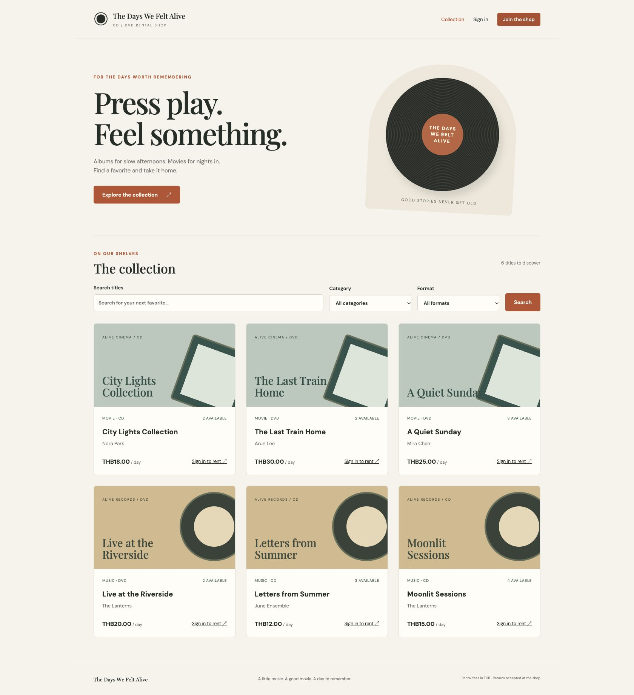
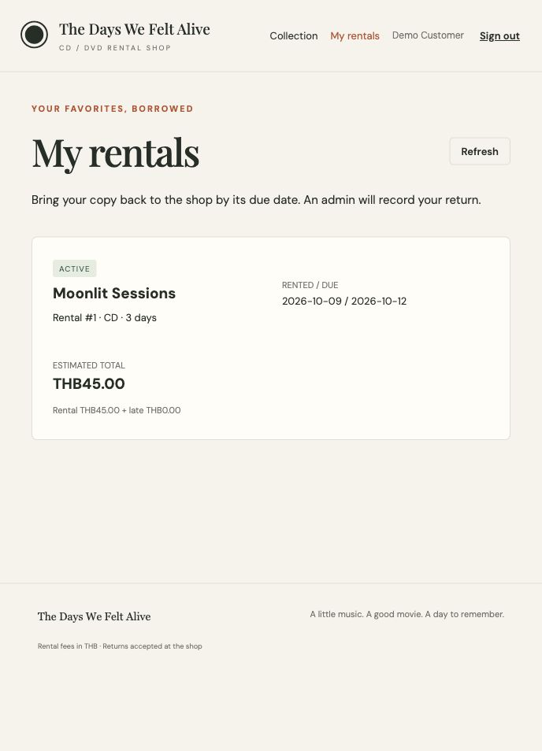
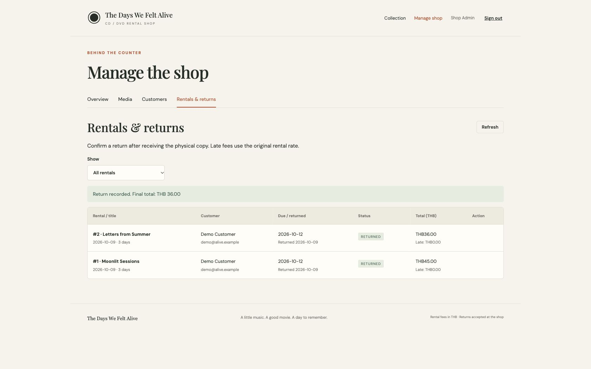
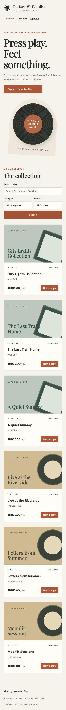

# Verification record

Checked locally on **2026-10-09 (Asia/Bangkok)**.

| Check                                               | Result                                                                                                                       |
| --------------------------------------------------- | ---------------------------------------------------------------------------------------------------------------------------- |
| Backend Docker build and startup                    | Pass: Express and MySQL healthy                                                                                              |
| Frontend Docker build and API proxy                 | Pass: `/api/v1/health` through port 4200 returns 200                                                                         |
| Angular production build                            | Pass: initial bundle approximately 371 KB raw                                                                                |
| Date and fee unit tests                             | 2 / 2 pass                                                                                                                   |
| MySQL integration scenarios                         | 5 / 5 pass                                                                                                                   |
| Customer registration and automatic login           | Pass in Codex browser                                                                                                        |
| Music filter and online rental                      | Pass, availability decreased immediately                                                                                     |
| My rentals and page-refresh session restore         | Pass                                                                                                                         |
| Admin login, overview, media create/update          | Pass in Chrome                                                                                                               |
| Customer management and delete confirmation display | Pass; permanent delete verified in API integration suite                                                                     |
| In-app admin return confirmation                    | Pass: Letters from Summer returned with final THB 36.00                                                                      |
| Return stock recovery                               | Pass: catalog copies restored after both demo returns                                                                        |
| Mobile catalog at 390 × 844                         | Pass: no horizontal page overflow                                                                                            |
| Database persistence                                | Pass after removing/recreating API and database containers without deleting volume: 6 titles and 2 returned rentals retained |
| Presentation                                        | 8 slides, package/layout/font/import validation passes, every slide visually inspected                                       |

The last-copy concurrency test initially found stale MySQL snapshot reads. The implementation now uses READ COMMITTED transactions with a locked media row. The regression passes: two customers competing for one copy receive one 201 and one 409. Parallel requests sharing a request key produce exactly one rental and one replay.

Integration tests also verify invalid/expired JWTs, role/ownership restrictions, duplicate emails, password filtering, CRUD input errors, rate snapshots, late and on-time returns, repeated returns, and retained history after archival/deactivation. The suite runs against its own tmpfs `alive_test` database, not the app database.

The original native-browser confirmation was replaced with an in-app modal. The final return flow was verified in Chrome with that modal.

## Browser evidence

The prepared local demo contains a fictional Demo Customer and two returned rentals. Temporary browser test media was removed. Fresh installs seed only the admin and six fictional titles. No online payment or remote production deployment was tested. The deck was rendered and inspected using the artifact runtime, not native PowerPoint.
